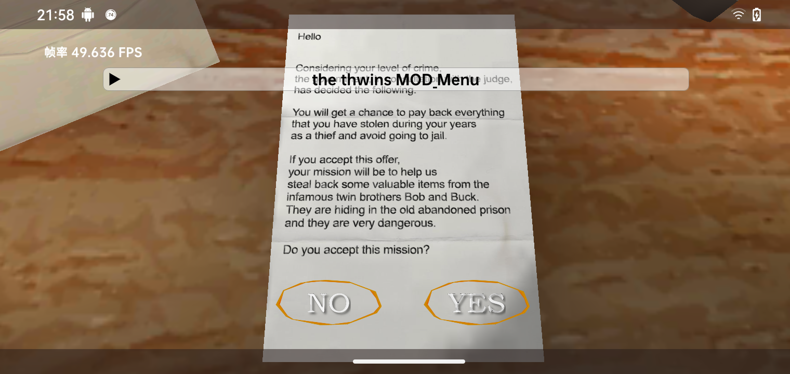

# imgui U3D

[YUMI绘制](./HZ/README.md)

[YUMI](./YUMI/README.md)

[纯C绘制](./jni/src/main.cpp)




# How to build
>
>- 1.下载 17_ndk 和 adb

[AndroidSDK](https://mirrors.cloud.tencent.com/AndroidSDK/)

[17ndk for linux](https://mirrors.cloud.tencent.com/AndroidSDK/android-ndk-r17c-linux-x86_64.zip)

[17ndk for windows](https://mirrors.cloud.tencent.com/AndroidSDK/android-ndk-r17c-windows-x86_64.zip)

[adb for windows](https://mirrors.cloud.tencent.com/AndroidSDK/platform-tools_r34.0.5-windows.zip)

[adb for linux](https://mirrors.cloud.tencent.com/AndroidSDK/platform-tools_r34.0.5-linux.zip)

>- 2.修改Makefile
>
```
NDK=D:\Android\SDK\ndk\17.2.4988734\ndk-build.cmd
SHELL=powershell
ADB=D:\Android\SDK\platform-tools\adb.exe
```

make build修改NDK就好

make UP都要改

**NDK 和 ADB 复制绝对路径**

**不同系统的SHELL设置**

liunx:

`SHELL=sh`

win:

`SHELL=powershell`
>
>- 3.make build
>
# 纯C 运行

***
**给777权限  root 执行**

**需要root**

**记得给sh root权限**
***

# bilibili:[Effectae](https://space.bilibili.com/2064476451)
